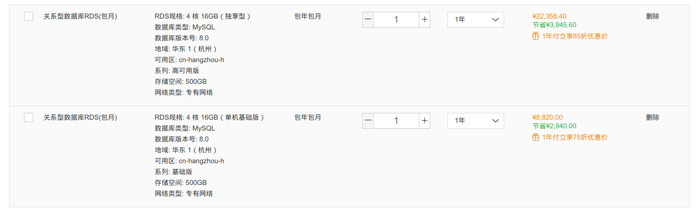
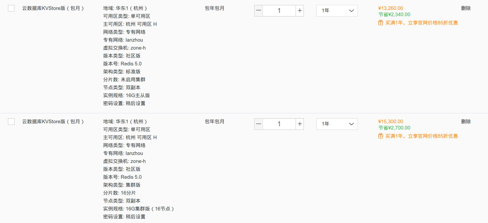
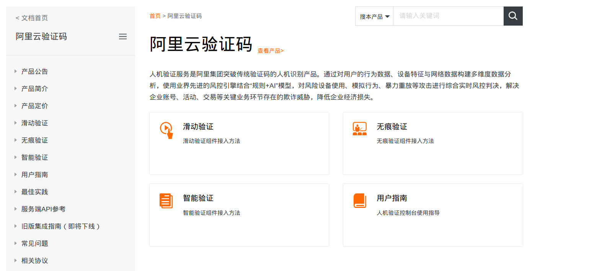

= 资源服务器申请单
Liuwenke <qwfys200@qq.com>
1.0, June 09, 2021, Asciidoctor 1.5 article template
:toc:
:toc-title: Apply resource server for alibaba cloud
:toclevels: 4
:icons: font
:pdf-fontsdir: fonts
:quick-uri: http://asciidoctor.org/docs/asciidoc-syntax-quick-reference/
//ifndef::imagesdir[:imagesdir: ./images]
//ifndef::sourcedir[:sourcedir: ../java]

:imagesdir: ./images
:sourcedir: ../java

征信修复系统资源服务申请单如下

== Alibaba Cloud MySQL Server

根据现阶段我们的实际情况，阿里云上MySQL服务器可以选择如下两款。

.MySQL选型

基础版::

主要针对小型应用或者个人应用，因为是单机模式，所以容灾能力不强。

高可用版::

主要针对大中小型应用，系统采用主-从读写分离模式，既解决了系统读写不均衡带来的问题，也做到主-从备灾，系统可用性大大增强。

官方文档::

https://help.aliyun.com/document_detail/96047.html?spm=a2c4g.11174283.6.605.58115b83qDJ6PV

== Alibaba Redis Server

.Redis选型

官方文档::

https://help.aliyun.com/product/26340.html?spm=a2c4g.11174283.6.44.381f3436mQSZYF

== Alibaba Object Storage Service(OSS)

.Redis选型

官方文档::

https://help.aliyun.com/product/31815.html?spm=a2c4g.11186623.6.540.6da34efdfvN8iq

== Alibaba Shot Message Service(SMS)

短信服务（Short Message Service）是广大企业客户快速触达手机用户所优选使用的通信能力。调用API或用群发助手，即可发送验证码、通知类和营销类短信；国内验证短信秒级触达，到达率最高可达99%；国际/港澳台短信覆盖200多个国家和地区，安全稳定，广受出海企业选用。

官方文档::

https://help.aliyun.com/product/44282.html?spm=a2c4g.11186623.6.540.3dfe50caYwoaZn

== Alibaba Cloud SSL Certificates Service(SSL)

SSL证书服务（Alibaba Cloud SSL Certificates Service）是由阿里云联合中国及中国以外地域多家数字证书颁发机构（ CA，Certificate Authority），在阿里云平台上直接提供的数字证书申请和部署服务。SSL证书服务帮助您以最小的成本将服务从HTTP转换成HTTPS，实现网站或移动应用的身份验证和数据加密传输。

官方文档::

https://help.aliyun.com/product/28533.html?spm=a2c4g.750001.list.71.52657b13ul5rKI

== Enterprise Distributed Application Service(EDAS)

企业级分布式应用服务EDAS（Enterprise Distributed Application Service）是一个应用托管和微服务管理的PaaS平台，提供应用开发、部署、监控、运维等全栈式解决方案，支持Spring Cloud、Dubbo等微服务运行环境，助力您的应用轻松上云。

官方文档::

https://help.aliyun.com/product/29500.html?spm=a2c4g.750001.list.175.52657b13ul5rKI

== 智能核身

智能核身服务基于阿里经济体多模态人脸认证技术，通过活体检测、证件OCR等手段，在对自然人真实身份进行校验的同时，使用智能决策引擎进行综合分析，输出最终认证结果。本产品采用多种手段保障数据和业务安全，符合监管要求。

官方文档::

https://help.aliyun.com/product/177618.html?spm=a2c4g.750001.list.93.52657b13ul5rKI

== 阿里云验证码

人机验证服务是阿里集团突破传统验证码的人机识别产品。通过对用户的行为数据、设备特征与网络数据构建多维度数据分析，使用业界先进的风控引擎结合“规则+AI”模型，对风险设备使用、模拟行为、暴力重放等攻击进行综合实时风控判决，解决企业账号、活动、交易等关键业务环节存在的欺诈威胁，降低企业经济损失。

官方文档::

https://help.aliyun.com/product/177618.html?spm=a2c4g.750001.list.93.52657b13ul5rKI

== Mobile Push

移动推送（Mobile Push）是提供给移动开发者的移动端消息推送服务，通过在App中集成推送功能，进行高效、精准、实时的消息推送，从而使业务及时触达用户，提高用户粘性。

官方文档::

https://help.aliyun.com/product/30047.html?spm=a2c4g.750001.list.205.52657b13ul5rKI

